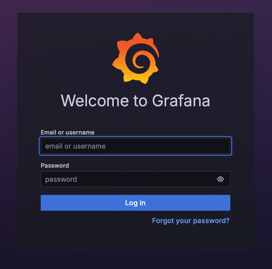
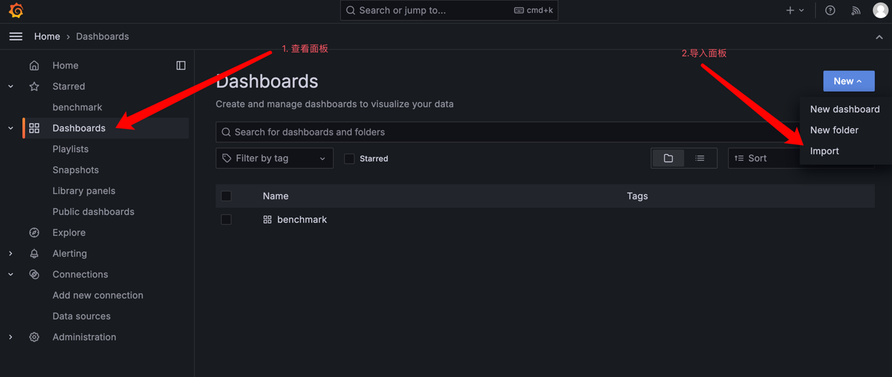
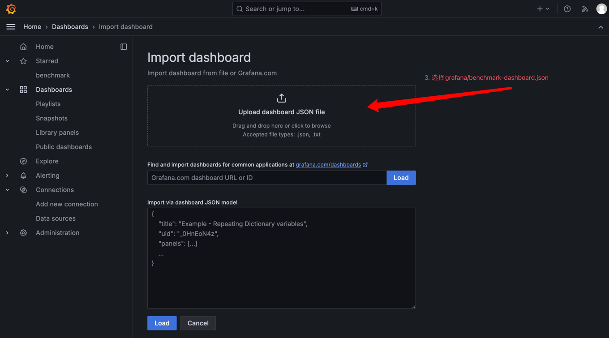

# 自动化的 Dubbo 框架与协议性能基准 Benchmark 机制与平台使用手册

## 环境要求
* JDK 1.8 （执行benchmark程序）
* Maven （构建代码）
* ncat （用于探测端口是否开放）
* jq （用于处理benchmark结果）
* mycli （用于操作数据库）
* MySQL 8（存储benchmark结果）
* Grafana（展示benchmark结果）
* Kubernetes （用于部署）

## 目录说明
* asserts 截图资源
* docker 存放执行benchmark时所需的基础镜像构建Dockerfile
* grafana 存放benchmark的grafana dashboard
* kubernetes 存放kubernetes相关的yaml

## 使用方式
### 1. 先进入存放yaml的kubernetes目录，然后执行以下命令
````shell
kubectl apply -f pvc.yaml
kubectl apply -f infra.yaml
kubectl apply -f benchmark-shell.yaml
kubectl apply -f benchmark-cron.yaml
````
### 2. 初始化mysql benchmark数据库
通过以下命令找到mysql pod
````shell
kubectl get pod
````
通过以下命令进入mysql容器
````shell
kubectl exec -it [mysql pod] -- /bin/bash
````
进入mysql容器后通过以下命令连接mysql, 默认密码root
````shell
mysql -u root -p
````
导入schema.sql文件
````shell
use benchmark;
source /home/dev/schema.sql;
````


### 3. 访问Grafana
可通过以下命令获取Grafana的地址
````shell
kubectl get svc grafana
````

### 4. 导入benchmark dashboard

然后在浏览器中输入地址，用户名密码为admin/admin (默认的账号密码)

登入Grafana后按照以下步骤导入`grafana/benchmark-dashboard.json`面板



### 5. 等待kubernetes调度benchmark任务
经过一段时间的benchmark后，便可以看到以下结果


