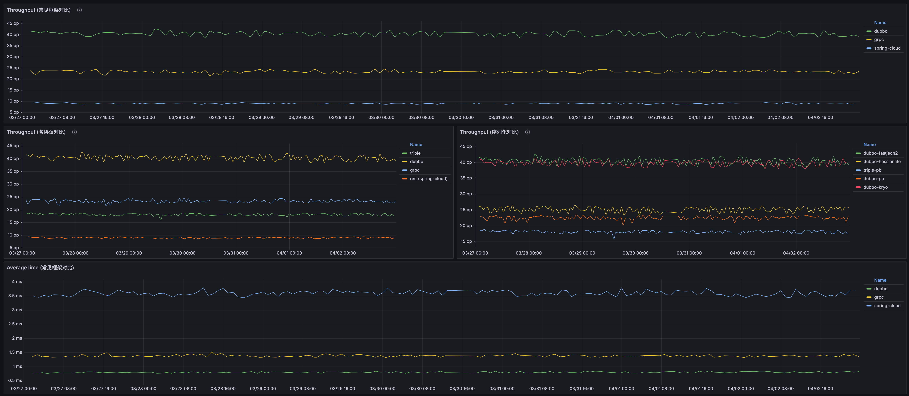
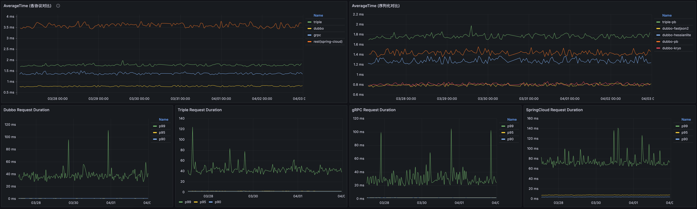

# 自动化的 Dubbo 框架与协议性能基准 Benchmark 机制与平台

---
* 队名：整点薯条
* 作者：icodening

## Objective

---

在本设计内，我们主要目标是基于Grafana和Kubernetes构建一个自动化的Dubbo Benchmark机制，实现对Dubbo框架中的各种协议组合的性能基准Benchmark的自动化采集。该套机制需要支持的内容如下。

* 支持自定义协议组合的采集，如dubbo+fastjson2，dubbo+hessian，triple+protobuf等
* 支持自定义调度采集性能基准指标，如每天1次，每周1次等
* 支持对不同协议、框架的性能基准对比及展示，如dubbo、grpc、spring cloud多种框架的对比
* 支持RT和OPS指标的对比

## Background

---

随着Dubbo框架的广泛应用，对其性能的要求也日益增加。为了确保Dubbo在各种场景下的性能表现，需要建立一个自动化的性能评估平台，以便对Dubbo进行全面的性能测试和评估。对用户而言，建设该平台后也能提供一个更直观的性能数据供用户参考。

## Proposal

---

整个自动化benchmark机制主要分为以下几个步骤：

1. 编写benchmark脚本，用于输出benchmark指标信息
2. 定时触发已编排好的benchmark任务
3. 将benchmark输出的结果文件按照一定的解析方式解析出关键数据
4. 将解析出来的数据写入持久层中
5. 将采集到的数据通过web图表的方式输出并展示

对于第一步，我们可以编写shell脚本，其大致逻辑为克隆dubbo仓库指定分支(可配置)并安装到本地maven仓库，克隆dubbo-benchmark工程并使用指定版本的dubbo开始基准性能测试

针对第二步，在Linux中我们可以通过crontab的方式实现定时调度，而在Kubernetes中我们可以通过cronjob的方式实现定时调度，这里我们基于Kubernetes平台实现该机制。

针对第三步，我们可以选择易读且易处理的JSON文件格式格式进行输出，这个可以在JMH中进行配置。

针对第四步，这里我们选择了比较主流的MySQL存储方式对benchmark数据做持久化。

而最后一步中，我们选择了美观易用的Grafana平台对MySQL中存储的benchmark指标进行展示。

基于以上方案实现后的效果如下图所示。

可以看到该平台支持展示不同框架的tps对比，如dubbo、grpc、spring-cloud之间的对比。同时也比较不同协议下的性能表现，如triple协议，dubbo协议，grpc协议，rest协议(基于spring cloud)之间的对比。还可以展示针对dubbo协议下，搭配不同的序列化方式的性能差异。
