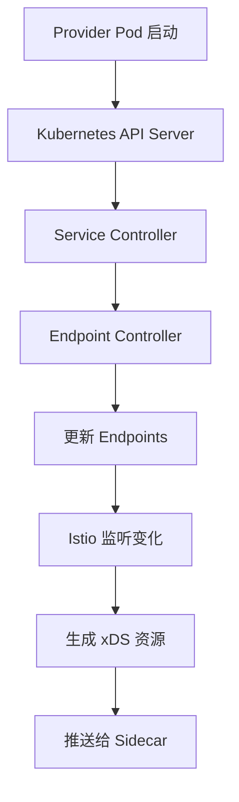
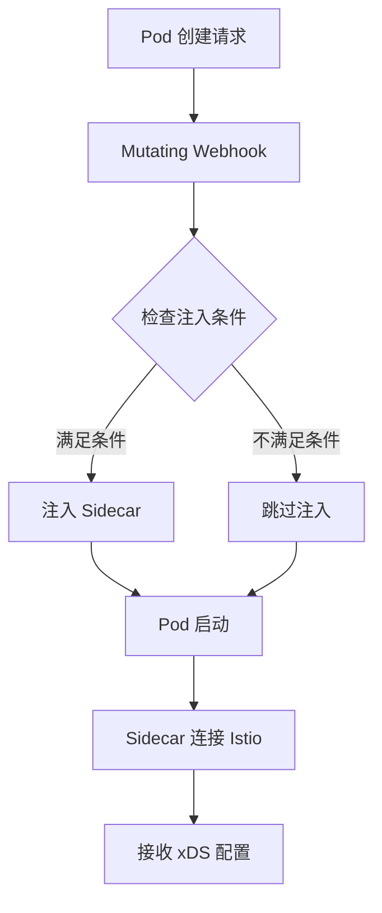

# Provider 注册到 Istio 的完整流程

## 1. 概述

Provider 注册到 Istio 的过程是一个多层次的自动发现机制，涉及 Kubernetes 服务发现、Istio 自动注入和 xDS 资源管理。这个过程是**自动的**，不需要手动注册。

## 2. 注册流程详解

### 2.1 Kubernetes 服务注册

#### 步骤 1: 创建 Kubernetes Service
```yaml
apiVersion: v1
kind: Service
metadata:
  name: dubbo-demo-xds-provider
  namespace: dubbo-proxyless
  labels:
    app: dubbo-demo-xds-provider
    service: dubbo-demo-xds-provider
spec:
  ports:
  - port: 50051
    name: grpc
    protocol: TCP
  selector:
    app: dubbo-demo-xds-provider  # 关键：选择器
  type: ClusterIP
```

**关键点**:
- `selector` 字段定义了哪些 Pod 属于这个 Service
- `app: dubbo-demo-xds-provider` 标签用于选择 Pod

#### 步骤 2: 部署 Provider Pod
```yaml
apiVersion: apps/v1
kind: Deployment
metadata:
  name: dubbo-demo-xds-provider-v1
  labels:
    app: dubbo-demo-xds-provider
    version: v1
spec:
  template:
    metadata:
      labels:
        app: dubbo-demo-xds-provider  # 匹配 Service 选择器
        version: v1
      annotations:
        sidecar.istio.io/inject: "true"  # 关键：启用 Istio 注入
```

**关键点**:
- Pod 标签 `app: dubbo-demo-xds-provider` 匹配 Service 选择器
- `sidecar.istio.io/inject: "true"` 启用 Istio 自动注入

### 2.2 Istio 自动注入

#### 步骤 3: Istio 自动注入 Sidecar
当 Pod 创建时，Istio 的 `mutating webhook` 会自动注入 sidecar 容器：

```yaml
# 注入后的 Pod 结构
spec:
  containers:
  - name: dubbo-demo-xds-provider  # 原始应用容器
    image: crpi-ta376u07gp1439ff.cn-beijing.personal.cr.aliyuncs.com/test_xds/test_dubbo_provider:latest
    ports:
    - containerPort: 50051
  - name: istio-proxy  # 自动注入的 sidecar
    image: docker.io/istio/proxyv2:1.20.0
    ports:
    - containerPort: 15090
    - containerPort: 15021
    - containerPort: 15020
```

**关键点**:
- Istio 自动注入 `istio-proxy` sidecar 容器
- Sidecar 负责与 Istio 控制面通信
- 应用容器通过 sidecar 进行服务发现和路由

### 2.3 Istio 服务发现

#### 步骤 4: Istio 自动发现服务
Istio 通过以下机制自动发现服务：

1. **Kubernetes API 监听**: Istio 监听 Kubernetes API 中的 Service 和 Endpoint 变化
2. **自动生成 xDS 资源**: 基于 Kubernetes 服务自动生成 LDS、RDS、CDS、EDS 资源
3. **推送给 Sidecar**: 将生成的 xDS 资源推送给各个 Pod 的 sidecar

```bash
# 查看 Istio 自动发现的服务
kubectl get endpoints -n dubbo-proxyless dubbo-demo-xds-provider

# 输出示例
NAME                        ENDPOINTS                                 AGE
dubbo-demo-xds-provider     10.244.1.30:50051,10.244.2.78:50051     5h
```

### 2.4 xDS 资源生成

#### 步骤 5: Istio 生成 xDS 资源
Istio 基于 Kubernetes 服务自动生成以下 xDS 资源：

**LDS (Listener Discovery Service)**:
```json
{
  "name": "0.0.0.0_50051",
  "address": {
    "socketAddress": {
      "address": "0.0.0.0",
      "portValue": 50051
    }
  },
  "filterChains": [
    {
      "filters": [
        {
          "name": "envoy.filters.network.http_connection_manager",
          "typedConfig": {
            "routeConfig": {
              "name": "dubbo-demo-xds-provider.dubbo-proxyless.svc.cluster.local:50051",
              "virtualHosts": [
                {
                  "name": "dubbo-demo-xds-provider.dubbo-proxyless.svc.cluster.local:50051",
                  "domains": ["dubbo-demo-xds-provider.dubbo-proxyless.svc.cluster.local"],
                  "routes": [
                    {
                      "route": {
                        "cluster": "outbound|50051|v1|dubbo-demo-xds-provider.dubbo-proxyless.svc.cluster.local"
                      }
                    }
                  ]
                }
              ]
            }
          }
        }
      ]
    }
  ]
}
```

**CDS (Cluster Discovery Service)**:
```json
{
  "name": "outbound|50051|v1|dubbo-demo-xds-provider.dubbo-proxyless.svc.cluster.local",
  "type": "EDS",
  "edsClusterConfig": {
    "edsConfig": {
      "ads": {}
    },
    "serviceName": "dubbo-demo-xds-provider.dubbo-proxyless.svc.cluster.local"
  }
}
```

**EDS (Endpoint Discovery Service)**:
```json
{
  "clusterName": "outbound|50051|v1|dubbo-demo-xds-provider.dubbo-proxyless.svc.cluster.local",
  "endpoints": [
    {
      "locality": {},
      "lbEndpoints": [
        {
          "endpoint": {
            "address": {
              "socketAddress": {
                "address": "10.244.1.30",
                "portValue": 50051
              }
            }
          }
        }
      ]
    }
  ]
}
```

### 2.5 流量规则配置

#### 步骤 6: 应用 Istio 流量规则
通过 `DestinationRule` 和 `VirtualService` 配置流量分割：

```yaml
# DestinationRule - 定义服务子集
apiVersion: networking.istio.io/v1alpha3
kind: DestinationRule
metadata:
  name: provider-versions
  namespace: dubbo-proxyless
spec:
  host: dubbo-demo-xds-provider.dubbo-proxyless.svc.cluster.local
  subsets:
  - name: v1
    labels:
      version: v1  # 匹配 Pod 标签
  - name: v2
    labels:
      version: v2  # 匹配 Pod 标签

---
# VirtualService - 定义路由规则
apiVersion: networking.istio.io/v1
kind: VirtualService
metadata:
  name: provider-weights
  namespace: dubbo-proxyless
spec:
  hosts:
  - dubbo-demo-xds-provider.dubbo-proxyless.svc.cluster.local
  http:
  - route:
    - destination:
        host: dubbo-demo-xds-provider.dubbo-proxyless.svc.cluster.local
        subset: v1
        port:
          number: 50051
      weight: 20
    - destination:
        host: dubbo-demo-xds-provider.dubbo-proxyless.svc.cluster.local
        subset: v2
        port:
          number: 50051
      weight: 80
```

## 3. 自动发现机制

### 3.1 Kubernetes 服务发现


### 3.2 Istio 自动注入


## 4. 验证 Provider 注册

### 4.1 检查 Pod 状态
```bash
# 查看 Provider Pod
kubectl get pods -n dubbo-proxyless -l app=dubbo-demo-xds-provider

# 输出示例
NAME                                          READY   STATUS    RESTARTS   AGE
dubbo-demo-xds-provider-v1-86d7b7b99d-nvcqt   2/2     Running   0          5h22m
dubbo-demo-xds-provider-v2-74f7c45cf-gkk7h    2/2     Running   0          5h22m
```

**关键点**: `2/2` 表示每个 Pod 有 2 个容器（应用容器 + sidecar）

### 4.2 检查 Service 和 Endpoints
```bash
# 查看 Service
kubectl get service -n dubbo-proxyless dubbo-demo-xds-provider

# 查看 Endpoints
kubectl get endpoints -n dubbo-proxyless dubbo-demo-xds-provider

# 查看 Endpoints 详情
kubectl describe endpoints -n dubbo-proxyless dubbo-demo-xds-provider
```

### 4.3 检查 Istio 配置
```bash
# 查看 VirtualService
kubectl get virtualservice -n dubbo-proxyless

# 查看 DestinationRule
kubectl get destinationrule -n dubbo-proxyless

# 查看 Istio 代理状态
kubectl exec -n dubbo-proxyless dubbo-demo-xds-provider-v1-xxx -c istio-proxy -- pilot-agent request GET config_dump
```

## 5. 关键配置点

### 5.1 必须的标签和注解
```yaml
metadata:
  labels:
    app: dubbo-demo-xds-provider  # 必须：匹配 Service 选择器
    version: v1                    # 必须：用于流量分割
  annotations:
    sidecar.istio.io/inject: "true"  # 必须：启用 Istio 注入
```

### 5.2 端口配置
```yaml
spec:
  containers:
  - name: dubbo-demo-xds-provider
    ports:
    - containerPort: 50051  # 必须：应用端口
      name: grpc            # 必须：端口名称
      protocol: TCP
```

### 5.3 环境变量
```yaml
env:
- name: SERVICE_VERSION
  value: "v1"  # 必须：用于版本标识
- name: POD_NAME
  valueFrom:
    fieldRef:
      fieldPath: metadata.name
```

## 6. 故障排查

### 6.1 常见问题

1. **Pod 没有 Sidecar**:
   ```bash
   # 检查 Pod 容器数量
   kubectl get pods -n dubbo-proxyless -o wide
   # 应该是 2/2，如果显示 1/1 说明没有注入 sidecar
   ```

2. **Service 没有 Endpoints**:
   ```bash
   # 检查 Pod 标签是否匹配 Service 选择器
   kubectl get pods -n dubbo-proxyless --show-labels
   kubectl get service -n dubbo-proxyless dubbo-demo-xds-provider -o yaml
   ```

3. **流量规则不生效**:
   ```bash
   # 检查 VirtualService 和 DestinationRule
   kubectl get virtualservice,destinationrule -n dubbo-proxyless
   
   # 检查 Istio 代理配置
   kubectl exec -n dubbo-proxyless <pod-name> -c istio-proxy -- pilot-agent request GET config_dump
   ```

### 6.2 调试命令
```bash
# 查看 Pod 详细信息
kubectl describe pod -n dubbo-proxyless <pod-name>

# 查看 Sidecar 日志
kubectl logs -n dubbo-proxyless <pod-name> -c istio-proxy

# 查看应用日志
kubectl logs -n dubbo-proxyless <pod-name> -c dubbo-demo-xds-provider

# 进入 Sidecar 容器调试
kubectl exec -it -n dubbo-proxyless <pod-name> -c istio-proxy -- /bin/sh
```

## 7. 总结

Provider 注册到 Istio 的过程是**完全自动的**，主要步骤包括：

1. **Kubernetes 层面**: Service + Pod 创建 → Endpoints 自动生成
2. **Istio 层面**: 自动注入 Sidecar → 监听服务变化 → 生成 xDS 资源
3. **配置层面**: DestinationRule + VirtualService → 定义流量规则
4. **运行时**: Sidecar 接收 xDS 配置 → 执行路由决策

整个过程无需手动注册，只需要正确配置 Kubernetes 资源和 Istio 规则即可。 