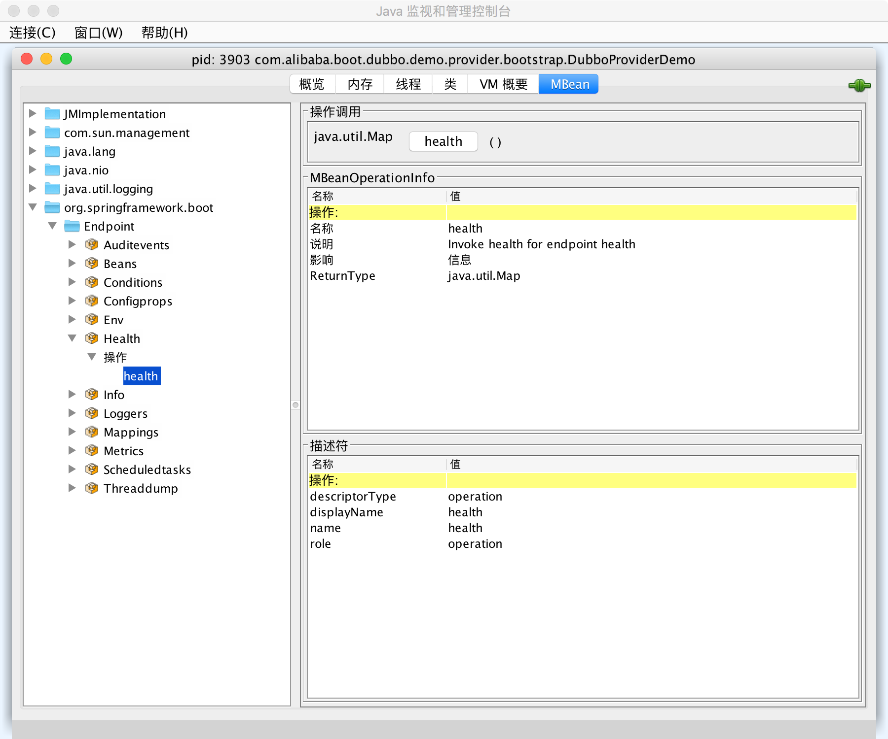

# Dubbo Spring Boot Production-Ready

`dubbo-spring-boot-actuator` provides production-ready features (e.g. [health checks](#health-checks),  [endpoints](#endpoints), and [externalized configuration](#externalized-configuration)).


## Content

1. [Main Content](https://github.com/apache/dubbo-spring-boot-project)
2. [Integrate with Maven](#integrate-with-maven)
3. [Health Checks](#health-checks)
4. [Endpoints](#endpoints)
5. [Externalized Configuration](#externalized-configuration)


## Integrate with Maven

You can introduce the latest `dubbo-spring-boot-actuator` to your project by adding the following dependency to your pom.xml
```xml
<dependency>
    <groupId>org.apache.dubbo</groupId>
    <artifactId>dubbo-spring-boot-actuator</artifactId>
    <version>2.7.4.1</version>
</dependency>
```

If your project failed to resolve the dependency, try to add the following repository:
```xml
<repositories>
    <repository>
        <id>apache.snapshots.https</id>
        <name>Apache Development Snapshot Repository</name>
        <url>https://repository.apache.org/content/repositories/snapshots</url>
        <releases>
            <enabled>false</enabled>
        </releases>
        <snapshots>
            <enabled>true</enabled>
        </snapshots>
    </repository>
</repositories>
```


## Health Checks

`dubbo-spring-boot-actuator`  supports the standard Spring Boot `HealthIndicator` as a production-ready feature , which will be aggregated into Spring Boot's `Health` and exported on `HealthEndpoint` that works MVC (Spring Web MVC) and JMX (Java Management Extensions) both if they are available.


### Web Endpoint : `/health`


Suppose a Spring Boot Web application did not specify `management.server.port`, you can access http://localhost:8080/actuator/health via Web Client and will get a response with JSON format is like below : 

```json
{
  "status": "UP",
  "dubbo": {
    "status": "UP",
    "memory": {
      "source": "management.health.dubbo.status.defaults",
      "status": {
        "level": "OK",
        "message": "max:3641M,total:383M,used:92M,free:291M",
        "description": null
      }
    },
    "load": {
      "source": "management.health.dubbo.status.extras",
      "status": {
        "level": "OK",
        "message": "load:1.73583984375,cpu:8",
        "description": null
      }
    },
    "threadpool": {
      "source": "management.health.dubbo.status.extras",
      "status": {
        "level": "OK",
        "message": "Pool status:OK, max:200, core:200, largest:0, active:0, task:0, service port: 12345",
        "description": null
      }
    },
    "server": {
      "source": "dubbo@ProtocolConfig.getStatus()",
      "status": {
        "level": "OK",
        "message": "/192.168.1.103:12345(clients:0)",
        "description": null
      }
    }
  }
  // ignore others
}
```


 `memory`, `load`,  `threadpool` and `server` are Dubbo's build-in `StatusChecker`s in above example. 
 Dubbo allows the application to extend `StatusChecker`'s SPI. 

Default , `memory` and `load` will be added into Dubbo's `HealthIndicator` , it could be overridden by 
externalized configuration [`StatusChecker`'s defaults](#statuschecker-defaults).


### JMX Endpoint : `Health`


`Health` is a JMX (Java Management Extensions) Endpoint with ObjectName `org.springframework.boot:type=Endpoint,name=Health` , it can be managed by JMX agent ,e.g. JDK tools : `jconsole` and so on.




### Build-in `StatusChecker`s


 `META-INF/dubbo/internal/org.apache.dubbo.common.status.StatusChecker` declares Build-in `StatusChecker`s as follow :

```properties
registry=org.apache.dubbo.registry.status.RegistryStatusChecker
spring=org.apache.dubbo.config.spring.status.SpringStatusChecker
datasource=org.apache.dubbo.config.spring.status.DataSourceStatusChecker
memory=org.apache.dubbo.common.status.support.MemoryStatusChecker
load=org.apache.dubbo.common.status.support.LoadStatusChecker
server=org.apache.dubbo.rpc.protocol.dubbo.status.ServerStatusChecker
threadpool=org.apache.dubbo.rpc.protocol.dubbo.status.ThreadPoolStatusChecker
```


The property key that is name of  `StatusChecker` can be a valid value of `management.health.dubbo.status.*` in externalized configuration.


## Endpoints


Actuator endpoint `dubbo` supports Actuator Endpoints : 

| ID       | Enabled          | HTTP URI            | HTTP Method | Description                         | Content Type       |
| ------------------- | ----------- | ----------------------------------- | ------------------ | ------------------ | ------------------ |
| `dubbo`    | `true`      | `/actuator/dubbo`            | `GET`       | Exposes Dubbo's meta data           | `application/json` |
| `dubboproperties` | `true` | `/actuator/dubbo/properties` | `GET`       | Exposes all Dubbo's Properties      | `application/json` |
| `dubboservices` | `false`     | `/actuator/dubbo/services`            | `GET`       | Exposes all Dubbo's `ServiceBean`   | `application/json` |
| `dubboreferences` | `false` | `/actuator/dubbo/references` | `GET`       | Exposes all Dubbo's `ReferenceBean` | `application/json` |
| `dubboconfigs` | `true` | `/actuator/dubbo/configs`    | `GET`       | Exposes all Dubbo's `*Config`       | `application/json` |
| `dubboshutdown` | `false` | `/actuator/dubbo/shutdown`   | `GET`   | Shutdown Dubbo services             | `application/json` |
| `dubbohelp` | `true` | `/actuator/dubbo/help` | `GET` | List all commands |  |
| `dubboready` | `true` | `/actuator/dubbo/ready` | `GET` | Check whether the current process/service is ready for external service | `application/json` |
| `dubbols` | `true` | `/actuator/dubbo/ls` | `GET` | List consumers and providers | `application/json` |
| `dubbostartup` | `true` | `/actuator/dubbo/startup` | `GET` | Check if the current framework has been started | `application/json` |
| `dubbops` | `true` | `/actuator/dubbo/ps` | `GET` | View information about the current process, including `listenable` ports | `application/json` |
| `dubboversion` | `true` | `/actuator/dubbo/version` | `GET` | Display the version number of the currently running `Dubbo` | `application/json` |
| `dubbogetaddress` | `true` | `/actuator/dubbo/getaddress?args=xxx.*` | `GET` | View the list of valid `IP` addresses for a service | `application/json` |
| `dubbogetconfig` | `true` | `/actuator/dubbo/getconfig` | `GET` | View the valid `configuration` of the current application | `application/json` |
| `dubbometrics` | `true` | `/actuator/dubbo/metrics` | `GET` | View `metrics`(Need to enable metrics statistics) | `application/json` |
| `dubbometrics_default` | `true` | `/actuator/dubbo/metrics_default` | `GET` | View the default `metrics`(Need to enable metrics statistics) | `application/json` |
| `dubbopublishmetadata` | `true` | `/actuator/dubbo/publishmetadata` or `/actuator/dubbo/publishmetadata?args=10` | `GET` | Publishes or updates the current application `Metadata` (Delay can be set) | `application/json` |
| `dubboonline` | `true` | `/actuator/dubbo/online` or `/actuator/dubbo/online?args=xxx.*` | `GET` | Register one or more services to the registry (including application and interface addresses) | `application/json` |
| `dubboonlineapp` | `true` | `/actuator/dubbo/onlineApp` or `/actuator/dubbo/onlineApp?args=xxx.xxx.*` | `GET` | Register one or more services to the registry (only application addresses) | `application/json` |
| `dubboonlineinterface` | `true` | `/actuator/dubbo/onlineInterface` or `/actuator/dubbo/onlineInterface?args=xxx.*` | `GET` | Register one or more services to the registry (only interface addresses) | `application/json` |
| `dubbooffline` | `true` | `/actuator/dubbo/offline` or `/actuator/dubbo/offline?args=xxx.*` | `GET` | Unregister one or more services from the registry (including application and interface addresses) | `application/json` |
| `dubboofflineapp` | `true` | `/actuator/dubbo/offlineApp` or `/actuator/dubbo/offlineApp?args=xxx.*` | `GET` | Unregister one or more services from the registry (only application addresses) | `application/json` |
| `dubboofflineinterface` | `true` | `/actuator/dubbo/offlineInterface` or `/actuator/dubbo/offlineInterface?args=xxx.*` | `GET` | Unregister one or more services from the registry (only interface addresses) | `application/json` |
| `dubbologgerinfo` | `true` | `/actuator/dubbo/loggerInfo` | `GET` | Query log configuration | `application/json` |
| `dubboswitchlogger` | `true` | `/actuator/dubbo/switchLogger?args={loggerAdapterName}` | `GET` | Modify the log output framework，`loggerAdapterName`: `slf4j`, `jcl`, `log4j`, `jdk`, `log4j2` | `application/json` |
| `dubboswitchloglevel` | `true` | `/actuator/dubbo/switchLogLevel?args={level}` | `GET` | Modify log level，level: `ALL`, `TRACE`, `DEBUG`, `INFO`, `WARN`, `ERROR`, `OFF` | `application/json` |
| `dubbodisabledetailprofiler` | `true` | `/actuator/dubbo/disableDetailProfiler` | `GET` | Turn off `detail profiler` mode, it will not affect `simple profiler` | `application/json` |
| `dubboenabledetailprofiler` | `true` | `/actuator/dubbo/enableDetailProfiler` | `GET` | Enable the `detail profiler` mode, which is disabled by default, you need to enable the `simple profiler` mode to actually enable it | `application/json` |
| `dubbodisablesimpleprofiler` | `false` | `/actuator/dubbo/disableSimpleProfiler` | `GET` | Turn off the `simple profiler` mode, and the `detail profiler` will not be enabled after it is turned off | `application/json` |
| `dubboenablesimpleprofiler` | `true` | `/actuator/dubbo/enableSimpleProfiler` | `GET` | Enable `simple profiler` mode, enabled by default | `application/json` |
| `dubbosetprofilerwarnpercent` | `true` | `/actuator/dubbo/setProfilerWarnPercent?args={percent}` | `GET` | Control `serialization` alarm frequency (only for classes in the warning list) | `application/json` |
| `dubboserializecheckstatus` | `true` | `/actuator/dubbo/dubboserializecheckstatus` | `GET` | View the current configuration information | `application/json` |
| `dubboserializewarnedclasses` | `true` | `/actuator/dubbo/dubboserializewarnedclasses` | `GET` | View the real-time alarm list | `application/json` |
| `dubbodisableroutersnapshot` | `true` | `/actuator/dubbo/disableRouterSnapshot` or `/actuator/dubbo/disableRouterSnapshot?args=xxx.*` | `GET` | Disable routing result collection mode | `application/json` |
| `dubboenableroutersnapshot` | `true` | `/actuator/dubbo/enableRouterSnapshot` or `/actuator/dubbo/enableRouterSnapshot?args=xxx.*` | `GET` | Enable routing result collection mode | `application/json` |
| `dubbogetrecentroutersnapshot` | `true` | `/actuator/dubbo/getRecentRouterSnapshot` | `GET` | Obtain the historical routing status (up to 32 results stored) | `application/json` |
| `dubbogetenabledroutersnapshot` | `true` | `/actuator/dubbo/getEnabledRouterSnapshot` | `GET` | Get the services that are currently collecting | `application/json` |
| `dubbogracefulshutdown` | `false` | `/actuator/dubbo/gracefulShutdown` | `GET` | Unregister all services registered by the current IP instance from the registry | `application/json` |


### Web Endpoints


####  `/actuator/dubbo`

`/dubbo` exposes Dubbo's meta data : 

```json
{
  "timestamp": 1516623290166,
  "versions": {
    "dubbo-spring-boot": "2.7.5",
    "dubbo": "2.7.5"
  },
  "urls": {
    "dubbo": "https://github.com/apache/dubbo/",
    "google-group": "dev@dubbo.apache.org",
    "github": "https://github.com/apache/dubbo-spring-boot-project",
    "issues": "https://github.com/apache/dubbo-spring-boot-project/issues",
    "git": "https://github.com/apache/dubbo-spring-boot-project.git"
  }
}
```

### 

#### `/actuator/dubbo/properties`

`/actuator/dubbo/properties` exposes all Dubbo's Properties from Spring Boot Externalized Configuration (a.k.a `PropertySources`) : 

```json
{
  "dubbo.application.id": "dubbo-provider-demo",
  "dubbo.application.name": "dubbo-provider-demo",
  "dubbo.application.qos-enable": "false",
  "dubbo.application.qos-port": "33333",
  "dubbo.protocol.id": "dubbo",
  "dubbo.protocol.name": "dubbo",
  "dubbo.protocol.port": "12345",
  "dubbo.registry.address": "N/A",
  "dubbo.registry.id": "my-registry",
  "dubbo.scan.basePackages": "org.apache.dubbo.spring.boot.sample.provider.service"
}
```

The structure of JSON is simple Key-Value format , the key is property name as and the value is property value.


#### `/actuator/dubbo/services`

`/actuator/dubbo/services` exposes all Dubbo's `ServiceBean` that are declared via `<dubbo:service/>` or `@Service`  present in Spring `ApplicationContext` :

```json
{
  "ServiceBean@org.apache.dubbo.spring.boot.sample.api.DemoService#defaultDemoService": {
    "accesslog": null,
    "actives": null,
    "cache": null,
    "callbacks": null,
    "class": "org.apache.dubbo.config.spring.ServiceBean",
    "cluster": null,
    "connections": null,
    "delay": null,
    "document": null,
    "executes": null,
    "export": null,
    "exported": true,
    "filter": "",
    "generic": "false",
    "group": null,
    "id": "org.apache.dubbo.spring.boot.sample.api.DemoService",
    "interface": "org.apache.dubbo.spring.boot.sample.api.DemoService",
    "interfaceClass": "org.apache.dubbo.spring.boot.sample.api.DemoService",
    "layer": null,
    "listener": "",
    "loadbalance": null,
    "local": null,
    "merger": null,
    "mock": null,
    "onconnect": null,
    "ondisconnect": null,
    "owner": null,
    "path": "org.apache.dubbo.spring.boot.sample.api.DemoService",
    "proxy": null,
    "retries": null,
    "scope": null,
    "sent": null,
    "stub": null,
    "timeout": null,
    "token": null,
    "unexported": false,
    "uniqueServiceName": "org.apache.dubbo.spring.boot.sample.api.DemoService:1.0.0",
    "validation": null,
    "version": "1.0.0",
    "warmup": null,
    "weight": null,
    "serviceClass": "DefaultDemoService"
  }
}
```

The key is the Bean name of `ServiceBean` , `ServiceBean`'s properties compose value.


#### `/actuator/dubbo/references`

`/actuator/dubbo/references` exposes all Dubbo's `ReferenceBean` that are declared via `@Reference` annotating on `Field` or `Method  ` :

```json
{
  "private org.apache.dubbo.spring.boot.sample.api.DemoService org.apache.dubbo.spring.boot.sample.consumer.controller.DemoConsumerController.demoService": {
    "actives": null,
    "cache": null,
    "callbacks": null,
    "class": "org.apache.dubbo.config.spring.ReferenceBean",
    "client": null,
    "cluster": null,
    "connections": null,
    "filter": "",
    "generic": null,
    "group": null,
    "id": "org.apache.dubbo.spring.boot.sample.api.DemoService",
    "interface": "org.apache.dubbo.spring.boot.sample.api.DemoService",
    "interfaceClass": "org.apache.dubbo.spring.boot.sample.api.DemoService",
    "layer": null,
    "lazy": null,
    "listener": "",
    "loadbalance": null,
    "local": null,
    "merger": null,
    "mock": null,
    "objectType": "org.apache.dubbo.spring.boot.sample.api.DemoService",
    "onconnect": null,
    "ondisconnect": null,
    "owner": null,
    "protocol": null,
    "proxy": null,
    "reconnect": null,
    "retries": null,
    "scope": null,
    "sent": null,
    "singleton": true,
    "sticky": null,
    "stub": null,
    "stubevent": null,
    "timeout": null,
    "uniqueServiceName": "org.apache.dubbo.spring.boot.sample.api.DemoService:1.0.0",
    "url": "dubbo://localhost:12345",
    "validation": null,
    "version": "1.0.0",
    "invoker": {
      "class": "org.apache.dubbo.common.bytecode.proxy0"
    }
  }
}
```

The key is the string presentation of `@Reference` `Field` or `Method  ` , `ReferenceBean`'s properties compose value.


#### `/actuator/dubbo/configs`

 `/actuator/dubbo/configs` exposes all Dubbo's `*Config` :

```json
{
  "ApplicationConfig": {
    "dubbo-consumer-demo": {
      "architecture": null,
      "class": "org.apache.dubbo.config.ApplicationConfig",
      "compiler": null,
      "dumpDirectory": null,
      "environment": null,
      "id": "dubbo-consumer-demo",
      "logger": null,
      "name": "dubbo-consumer-demo",
      "organization": null,
      "owner": null,
      "version": null
    }
  },
  "ConsumerConfig": {
    
  },
  "MethodConfig": {
    
  },
  "ModuleConfig": {
    
  },
  "MonitorConfig": {
    
  },
  "ProtocolConfig": {
    "dubbo": {
      "accepts": null,
      "accesslog": null,
      "buffer": null,
      "charset": null,
      "class": "org.apache.dubbo.config.ProtocolConfig",
      "client": null,
      "codec": null,
      "contextpath": null,
      "dispatcher": null,
      "dispather": null,
      "exchanger": null,
      "heartbeat": null,
      "host": null,
      "id": "dubbo",
      "iothreads": null,
      "name": "dubbo",
      "networker": null,
      "path": null,
      "payload": null,
      "port": 12345,
      "prompt": null,
      "queues": null,
      "serialization": null,
      "server": null,
      "status": null,
      "telnet": null,
      "threadpool": null,
      "threads": null,
      "transporter": null
    }
  },
  "ProviderConfig": {
    
  },
  "ReferenceConfig": {
    
  },
  "RegistryConfig": {
    
  },
  "ServiceConfig": {
    
  }
}
```

The key is the simple name of Dubbo `*Config`  Class , the value is`*Config` Beans' Name-Properties Map.


#### `/actuator/dubbo/shutdown`

`/actuator/dubbo/shutdown` shutdowns Dubbo's components including registries, protocols, services and references :

```json
{
    "shutdown.count": {
        "registries": 0,
        "protocols": 1,
        "services": 0,
        "references": 1
    }
}
```

"shutdown.count" means the count of shutdown of Dubbo's components , and the value indicates how many components have been shutdown.


`/actuator/dubbo/online`

```json
{
    "org.apache.dubbo.springboot.demo.DemoService:null": "online"
}
```


`/actuator/dubbo/offline`

```json
{
    "org.apache.dubbo.springboot.demo.DemoService:null": "offline"
}
```


`/actuator/dubbo/ready`

`/actuator/dubbo/ready` Detect whether the current framework can provide services normally (may be temporarily offline) :

```json
{
    "dubbo-springboot-demo-provider": "true"
}
```


`/actuator/dubbo/ls`

`/actuator/dubbo/ls `List consumers and providers :

```json
{
    "Providers": {
        "DubboInternal - dubbo-springboot-demo-provider/org.apache.dubbo.metadata.MetadataService:1.0.0": "",
        "DubboInternal - dubbo-springboot-demo-provider/org.apache.dubbo.metadata.MetadataServiceV2:2.0.0": "",
        "DubboInternal - dubbo-springboot-demo-provider/org.apache.dubbo.metrics.service.MetricsService:1.0.0": "",
        "org.apache.dubbo.springboot.demo.DemoService": "zookeeper-A(Y)/zookeeper-I(Y)"
    },
    "Consumers": {}
}
```

- Services prefixed with `DubboInternal` are built-in services of Dubbo, and are not registered with the registry by default.

- The first part of `zookeeper-A(Y)` in the service publishing status is the corresponding registry name, and the second part is the registration mode (`A` stands for application-level address registration, `I` stands for interface-level address registration), The third part represents whether the corresponding mode has been registered

- The first part of `zookeeper-AF(I-2,A-2)` in the service subscription status is the corresponding registration center name, and the second part is the subscription mode (`AF` stands for dual subscription mode, `FA` stands for only Application-level subscription, `FI` stands for interface-level subscription only), the first half of the third part represents the source of the address mode (`A` stands for application-level address, `I` stands for interface-level address), and the second half represents the corresponding number of addresses

  

`/actuator/dubbo/loggerInfo`

`/actuator/dubbo/loggerInfo` show available logging framework, the logging framework and log level ：

```json
{
    "Available logger adapters": [
        "log4j2",
        "slf4j",
        "jcl",
        "jdk"
    ],
    "Current Adapter": "slf4j",
    "Log level": "INFO"
}
```


`/actuator/dubbo/switchLogger?logger={loggerAdapterName}`

`/actuator/dubbo/switchLogger?logger={loggerAdapterName}` allows switching between available logger adapters, and the parameter cannot be empty :

```json
{
    "Current Adapter": "log4j2"
}
```


`/actuator/dubbo/switchLogLevel?level={level}`

`/actuator/dubbo/loggerInfo` allows switching between permitted log levels, and the parameter cannot be empty :

```json
{
    "Current Log Level": "WARN"
}
```

The log configuration modified by `switchLogger`/`switchLogLevel` is not stored persistently and will become invalid after the application is restarted.


`/actuator/dubbo/disableSimpleProfiler`

`/actuator/dubbo/disableSimpleProfiler` turn off the `simple profiler` mode, and the `detail profiler` will not be enabled after it is turned off :

```json
{
    "WARN": "Dubbo Invocation Profiler has been disabled"
}
```

The performance sampling function can detect the time consumption of various parts of the Dubbo processing link,where `simple profiler` mode is enabled by default.


`/actuator/dubbo/enableDetailProfiler`

`/actuator/dubbo/enableDetailProfiler` enable the `detail profiler` mode, which is disabled by default, you need to enable the `simple profiler` mode to actually enable it :

```json
{
    "WARN": "Dubbo Invocation Profiler has been enabled, This will cause performance degradation"
}
```

Compared with the `simple profiler` mode, the `detail profiler` collects more time-consuming processing of each filter, specific time-consuming protocols, etc. In the `simple profiler` mode, if you find that there is a long time-consuming situation inside the Dubbo framework, you can enable the `detail profiler` mode to better troubleshoot the problem.

`/actuator/dubbo/setProfilerPercent?p={precent}`

`/actuator/dubbo/setProfilerPercent?p={precent}` Control serialization alarm frequency (only for classes in the warning list) :
```json
{
    "Current Dubbo Invocation Profiler warn percent": 0.4
}
```


`/actuator/dubbo/disableRouterSnapshot{?service={servicePatern}}`

`/actuator/dubbo/disableRouterSnapshot?service={servicePatern}` disable routing result collection mode, `servicePatern` is the name of the service to be collected, which supports matching :

```json
{
    "org.apache.dubbo.springboot.demo.DemoService": "Router snapshot disabled"
}
```


`/actuator/dubbo/enableRouterSnapshot`

`/actuator/dubbo/enableRouterSnapshot?service={servicePatern}` enable routing result collection mode, `servicePatern` is the name of the service to be collected, which supports matching :

```json
{
    "WARN": "Enable router snapshot will cause performance degradation, please be careful!",
    "org.apache.dubbo.springboot.demo.DemoService": "Router snapshot enabled"
}
```


`/actuator/dubbo/getEnabledRouterSnapshot`

`/actuator/dubbo/getEnabledRouterSnapshot` get the services that are currently collecting

```json
{
    "Enabled router snapshot": [
        "org.apache.dubbo.springboot.demo.DemoService"
    ]
}
```

`/actuator/dubbo/gracefulShutdown` unregister all services registered by the current IP instance from the registry. The difference from 'offline' is that this command will also notify all consumers via TCP connection to stop calling this instance :
```json
{
 "org.apache.dubbo.springboot.demo.DemoService:null": "offline"
}
```
To restore, please execute 'online' to bring all services back online.


## Externalized Configuration


### `StatusChecker` Defaults


`management.health.dubbo.status.defaults` is a property name for setting names of `StatusChecker`s , its value is allowed to multiple-values , for example : 

```properties
management.health.dubbo.status.defaults = registry,memory,load
```


#### Default Value

The default value is : 

```properties
management.health.dubbo.status.defaults = memory,load
```


### `StatusChecker` Extras


`management.health.dubbo.status.extras` is used to override the [ [`StatusChecker`'s defaults]](#statuschecker-defaults) , the multiple-values is delimited by comma :

```properties
management.health.dubbo.status.extras = load,threadpool
```


### Health Checks Enabled


`management.health.dubbo.enabled` is a enabled configuration to turn on or off health checks feature, its' default is `true`.

 If you'd like to disable health checks ,  you could apply `management.health.dubbo.enabled` to be `false`:

```properties
management.health.dubbo.enabled = false
```


### Endpoints Enabled


Dubbo Spring Boot providers actuator endpoints , however some of them are disable. If you'd like to enable them , please add following properties into externalized configuration :

```properties
# Enables Dubbo All Endpoints
management.endpoint.dubbo.enabled = true
management.endpoint.dubboshutdown.enabled = true
management.endpoint.dubboconfigs.enabled = true
management.endpoint.dubboservices.enabled = true
management.endpoint.dubboreferences.enabled = true
management.endpoint.dubboproperties.enabled = true
management.endpoint.dubbohelp.enabled = true
management.endpoint.dubbocd.enabled = true
management.endpoint.dubbocount.enabled = true
management.endpoint.dubbopwd.enabled = true
management.endpoint.dubboinvoke.enabled = true
management.endpoint.dubboselect.enabled = true
management.endpoint.dubboready.enabled = true
management.endpoint.dubbols.enabled = true
management.endpoint.dubbostartup.enabled = true
management.endpoint.dubbops.enabled = true
management.endpoint.dubboversion.enabled = true
management.endpoint.dubbogetaddress.enabled = true
management.endpoint.dubbogetconfig.enabled = true
management.endpoint.dubbometrics.enabled = true
management.endpoint.dubbometrics_default.enabled = true
management.endpoint.dubbopublishMetadata.enabled = true
management.endpoint.dubboonline.enabled = true
management.endpoint.dubboonlineapp.enabled = true
management.endpoint.dubboonlineinterface.enabled = true
management.endpoint.dubbooffline.enabled = true
management.endpoint.dubboofflineapp.enabled = true
management.endpoint.dubboofflineinterface.enabled = true
management.endpoint.dubbologgerinfo.enabled = true
management.endpoint.dubboswitchlogger.enabled = true
management.endpoint.dubboswitchloglevel.enabled = true
management.endpoint.dubbodisabledetailprofiler.enabled = true
management.endpoint.dubbodisablesimpleprofiler.enabled = true
management.endpoint.dubboenabledetailprofiler.enabled = true
management.endpoint.dubboenablesimpleprofiler.enabled = true
management.endpoint.dubbosetprofilerwarnpercent.enabled = true
management.endpoint.dubboserializecheckstatus.enabled = true
management.endpoint.dubboserializewarnedclasses.enabled = true
management.endpoint.dubbodisableroutersnapshot.enabled = true
management.endpoint.dubboenableroutersnapshot.enabled = true
management.endpoint.dubbogetrecentroutersnapshot.enabled = true
management.endpoint.dubbogetenabledroutersnapshot.enabled = true
management.endpoint.dubbogracefulshutdown.enabled = true
```

